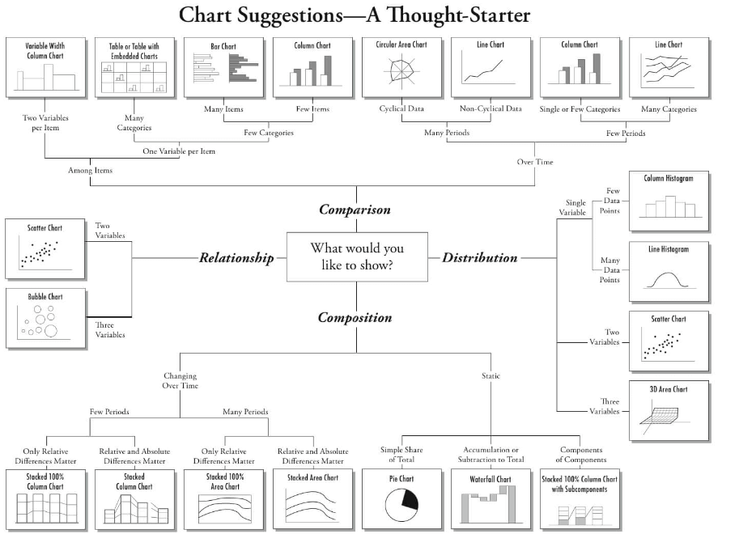

# Data-Visualization

Data visualization is an important skill in applied statistics and machine learning.

Statistics does indeed focus on quantitative descriptions and estimations of data. Data visualization provides an important suite of tools for gaining a qualitative understanding.

This can be helpful when exploring and getting to know a dataset and can help with identifying patterns, corrupt data, outliers, and much more. With a little domain knowledge, data visualizations can be used to express and demonstrate key relationships in plots and charts that are more visceral to yourself and stakeholders than measures of association or significance.

Data visualization and exploratory data analysis are whole fields themselves and I will recommend a deeper dive into some the books mentioned at the end. In this tutorial, let’s look at basic charts and plots you can use to better understand your data.

Below picture suggests which graph you would like to show depending on their usage:

